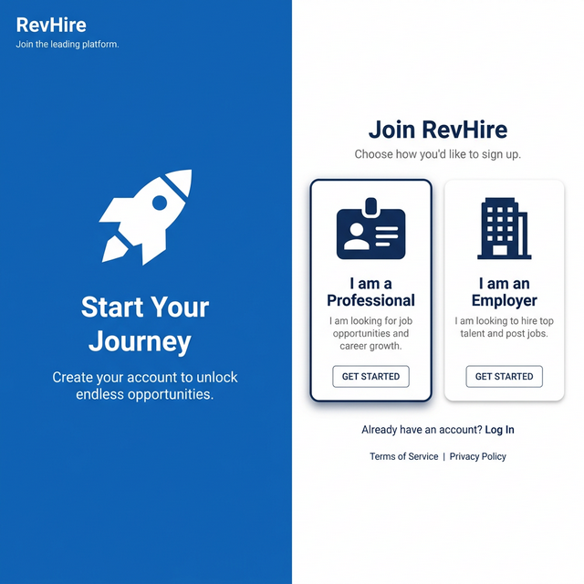
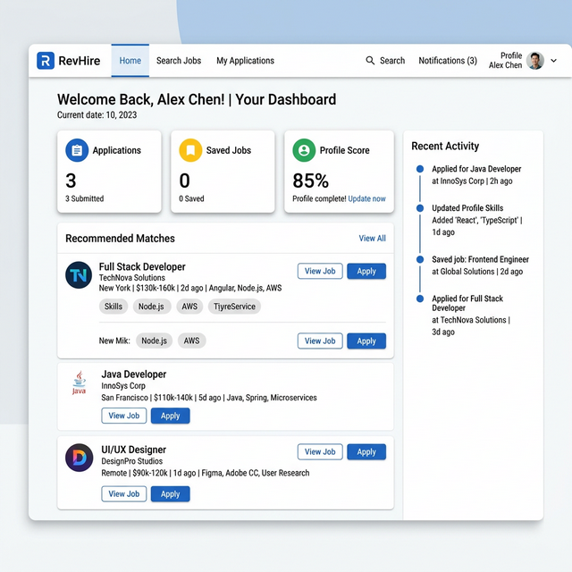
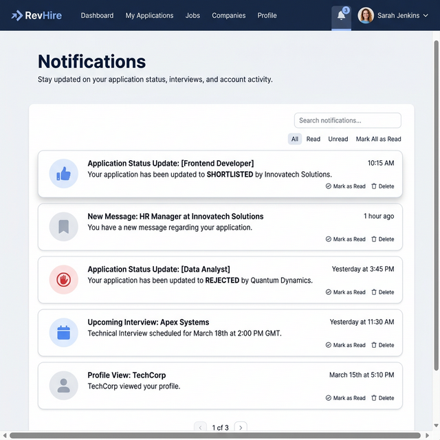
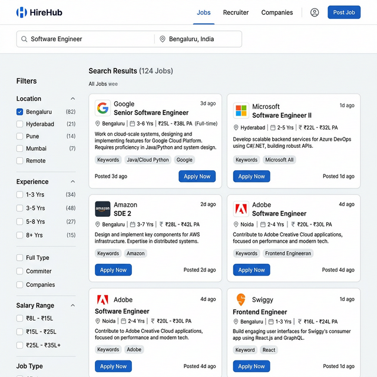
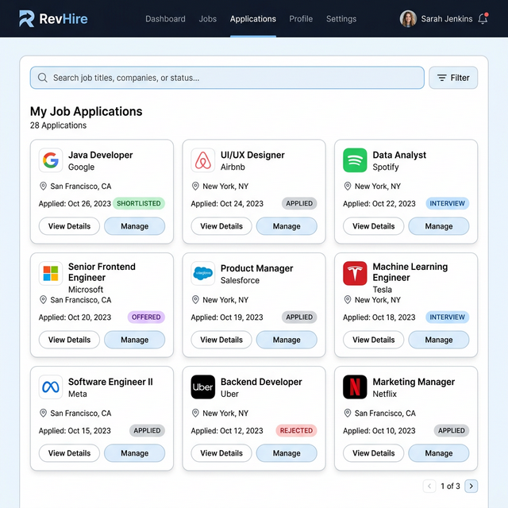
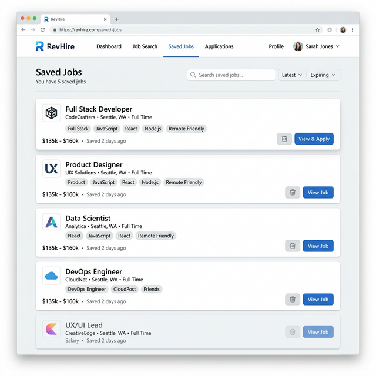
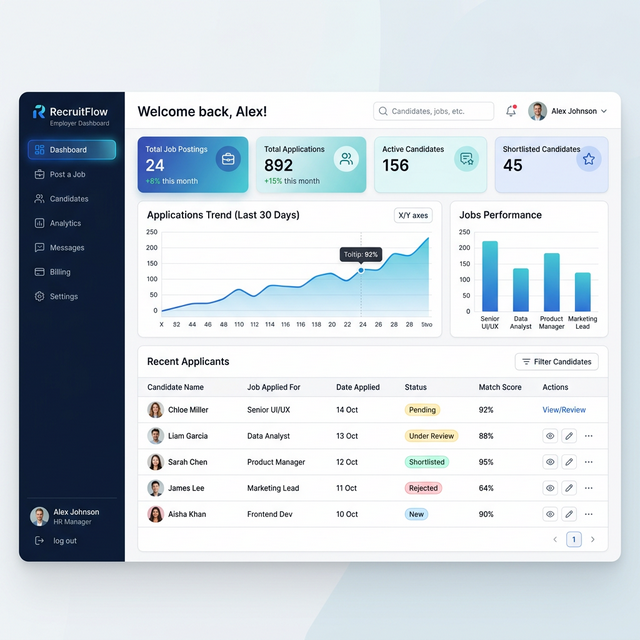
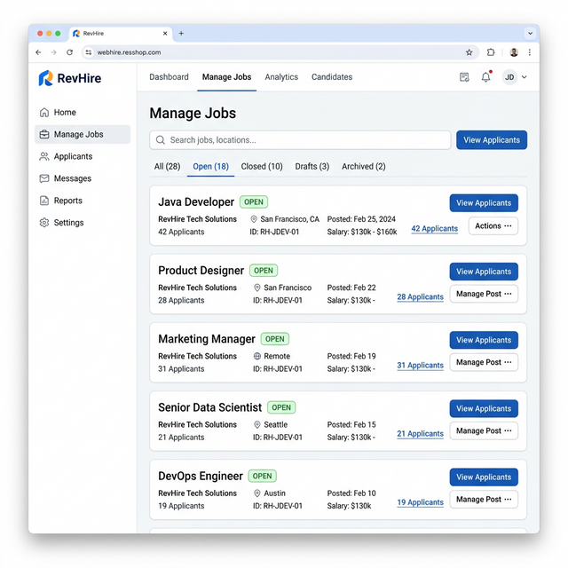
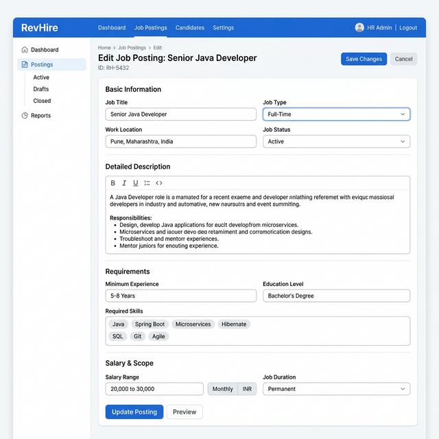
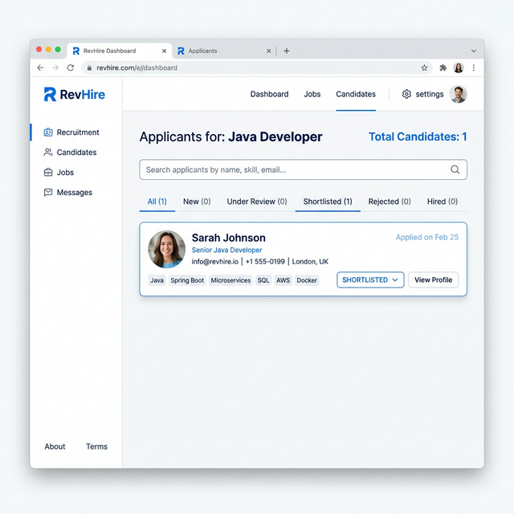

# RevHire (AuraJobs Edition)

RevHire (AuraJobs Edition) is a premium full-stack SaaS job portal (Naukri.com-inspired) built with **Angular 17** (frontend) and **Spring Boot 3 / Spring Security + JWT** (backend).

## Features

### Job Seeker
- Register/login (JWT)
- Search jobs + view job details
- Apply to jobs + track application status
- Save jobs for later review
- Profile management (education, experience, skills, certifications)
- Resume upload & document management
- Notifications (Application updates, job recommendations)
- Account Settings management

### Employer
- Employer & Company profile management
- Post and manage job listings
- View and manage applicants per job
- Update applicant status + add processing notes
- Download applicant resumes
- Real-time employer dashboard metrics view

### Admin
- Platform orchestration dashboard
- Comprehensive user management
- Platform-wide job listings management

## UI Screenshots

Below are some visual previews of the RevHire application:

### Home Page


### User Registration


### Job Seeker Dashboard


### Notifications


### Job Search & Filters


### My Applications


### Saved Jobs


### Employer Dashboard


### Manage Active Jobs


### Employer Job Posting


### Review Applicants


## Application Flow & Architecture

1. **User Authentication:** Both seekers and employers register and log in. JWT tokens are issued by the Spring Boot backend and stored securely on the frontend to authorize subsequent API requests.
2. **Job Posting (Employer):** Employers can create and manage their job postings through a dedicated dashboard metrics view. 
3. **Job Discovery (Seeker):** Seekers use the Angular-based search interface to filter active jobs by keyword, location, or salary, and view detailed job descriptions.
4. **Application Tracking:** Once a job seeker applies, the application appears in the Employer's dashboard, where they can review the candidate's profile/resume and update the application status (e.g., IN_REVIEW, ACCEPTED, REJECTED).

## Tech Stack

- **Frontend**: Angular 17, Tailwind CSS, Angular Material, RxJS
- **Backend**: Spring Boot 3.2, Spring Security, Spring Data JPA, JWT, ModelMapper
- **DB**: MySQL (default in local config), PostgreSQL supported via driver
- **API docs**: Springdoc OpenAPI (`/swagger-ui.html`)
- **Containerization**: Docker & Docker Compose

## Prerequisites

- Node.js 18+ and npm
- Angular CLI 17+
- Java 17
- Maven 3.9+
- MySQL 8+ (or PostgreSQL)

## Quick Start (Local)

### 1) Backend (Spring Boot)

1. Create a database (name should match your config).
2. Update DB connection in `src/main/resources/application.properties` (local/dev).

Current default local settings are:
- **Backend**: `http://localhost:8080`
- **DB URL**: `jdbc:mysql://localhost:3307/revhire_db`

Run:

```bash
mvn -DskipTests spring-boot:run
```

Swagger UI:
- `http://localhost:8080/swagger-ui.html`

### 2) Frontend (Angular)

Frontend expects the backend at:
- `http://localhost:8080/api/v1` (see `revhire-frontend/src/environments/environment.ts`)

Run:

```bash
cd revhire-frontend
npm install
npm start
```

App:
- `http://localhost:4200`

### 3) Run with Docker Compose

To quickly run both the backend and the database with Docker:

```bash
docker-compose up --build
```
This will start:
- **MySQL Database**: Exposed on port `3307` locally.
- **Spring Boot App**: Available at `http://localhost:8080`.

*(You can then run the frontend using `npm start` as shown above)*

## Configuration Notes

### Spring profiles

- **Default**: `src/main/resources/application.properties` (local MySQL, `ddl-auto=update`)
- **Dev**: `src/main/resources/application-dev.properties` (more verbose error output)
- **Prod**: `src/main/resources/application-prod.properties`
  - Uses env vars: `DB_URL`, `DB_USER`, `DB_PASS`
  - `spring.jpa.hibernate.ddl-auto=validate` (expects schema already created)

### Database schema scripts (optional)

- `revhire-schema-mysql.sql` (MySQL)
- `revhire-schema.sql` (PostgreSQL)

These are helpful for **production-like schema creation + seed data**. If you use them, consider setting:
- `spring.jpa.hibernate.ddl-auto=validate`

## Test Accounts (only if you ran the schema seed)

From the schema scripts:
- `seeker@test.com` / `password123`
- `employer@test.com` / `password123`

Otherwise, just register new accounts from the UI.

## Common Issues / Fixes

- **CORS error**: frontend must be `http://localhost:4200` (CORS is configured for it). If you change the frontend port, update `CorsConfig`.
- **401 Unauthorized**: clear localStorage and login again (token expired/invalid).
- **DB connection error**: verify MySQL port (`3307` in config), database name (`revhire_db`), username/password.
- **Job search returns empty**: backend supports both legacy params (`keyword`, `minExp`) and Angular params (`title`, `experienceMin`, `salaryMin`, `salaryMax`).

## Testing

Both frontend and backend components are equipped with automated tests to ensure application reliability.

### Backend (Spring Boot)
- **Unit Testing**: Tests are implemented using **JUnit 5** and **Mockito**.
- **Coverage**: Service layer modules (e.g., `UserServiceTest`, `JobServiceTest`, `ApplicationServiceTest`) and Controller layer logic are tested under `src/test/java/com/revhire/`.
- **Run Tests**: Execute `mvn test` in the root backend directory.

### Frontend (Angular)
- **Unit Testing**: Tests utilize the **Jasmine** and **Karma** testing framework.
- **Coverage**: Essential components (like `HomeComponent`, `RegisterComponent`) contain test coverage in `.spec.ts` files located within `revhire-frontend/src/app/`.
- **Run Tests**: Navigate to frontend folder (`cd revhire-frontend`) and execute `npm test` or `ng test`.

## Repository Layout

```text
RevHire/
  src/                        # Spring Boot backend
    main/
      java/com/revhire/        # controllers, services, security, models
      resources/               # application*.properties
  revhire-frontend/            # Angular frontend
  pom.xml                      # Maven dependencies
  docker-compose.yml           # Docker deployment config
  Dockerfile                   # Backend Dockerfile
  revhire-schema-mysql.sql     # Database setup
  revhire-schema.sql           # Database setup
  README.md
```
